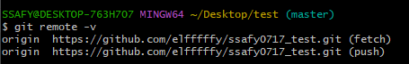

> *TIL 못하면 TILTIL 한 것* - 장상호 강사님

## 🤓 Preview
1. `git remote`를 정리했습니다.
2. `clone`과 `pull`을 정리했습니다.

### 🧷 git remote

```bash
# 로컬 저장소와 원격 저장소를 연결
# origin = 별칭
git remote add origin 저장소 url 

# remote 목록 확인
git remote -v 

# 가장 최근에 commit 되어있던 것을 강제로(+) push
git push origin +master 
```


### ⬇️ clone & pull
#### clone : 새로운 환경에서 처음 다운로드 할 때 사용한다.
```bash
git clone {url}
```

#### pull : `clone`을 받고, 그 이후에는 `pull`로 진행한다.
```bash
git pull origin +master
```
> 🤔 **clone을 받으면 remote를 할 필요가 있을까?**
> 
> ➡️ remote를 할 필요가 없다.

## ❎ gitignore
- 용량이 너무 크거나, 보안상 문제가 있거나, 청구 관련 api_key 같은 파일이 있을 경우 staging area에 올리지 않기 위해서이다.
- 수 백개의 파일을 일일이 `git add` 하기에는 불편하기 때문에 `.gitignore`파일을 만들면 편하다.
```bash
# .gitignore 파일을 만들고 add 하지 않을 파일명이나 폴더명을 작성하고 저장한다.
touch .gitignore
```

## 💡 git 명령어 심화
### ⚠️ git revert
- 특정 commit을 없었던 일로 만든다.
- `git log` -> 해시 값 전체 복사 + 붙여넣기
- vim 에디터 나오면 `esc` -> `:wq!`
```bash
git revert 해쉬값
```

### git reflog
- 이전 commit 기록들을 모두 볼 수 있다.
- `git log` -> 해시 값 전체 복사 + 붙여넣기
- vim 에디터 나오면 `esc` -> `:wq!`
```bash
git revert 해쉬값
```

### git reset
- 특정 commit으로 되돌린다.
```bash
git reset --hard HEAD@{번호}
```

### git add 취소 : staging area --> working directory
> git 2.24 버전 이후로는 명령어 차이가 없습니다.
1. commit이 없는 경우
   ```bash
   git rm --cached 파일명
   ```
2. commit이 있는 경우(⭐권장)
   ```bash
   git restore --staged 파일명
   ```